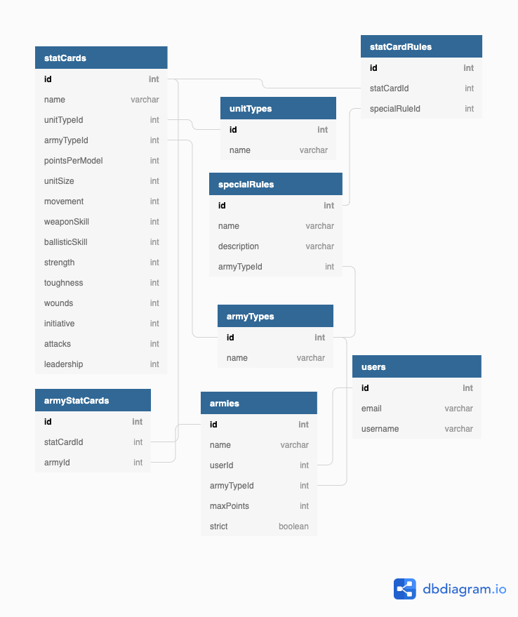

# H8er

## Why all the Hate?

I am a huge fan of tabletop gaming.  Some friends and myself are very passionate about Warhammer Fantasy, a tabletop game by Games Workshop.  Unfortunately, in 2014 Games Workshop completely reworked the game and released it as an entirely new game called Age of Sigmar.  Reactions were torn between loving and hating the new version of the game.  Most of my friends that play the game were in the same boat of hating the new version of the game and decided that we would just keep playing Warhammer Fantasy 8th edition. 

## What does H8er do?

H8er is an armylist generator app for Warhammer Fantasy 8th edition. My inspiration for this project came from the fact that most of the rulebooks for new editions of the game can be utilized in a digital format.  Warhammer 8th edition does not have any digital rulebooks.  Any time a rule or stats are unknown or there is debate on it during a game, a player has to flip through rulebooks and try to find what they are looking for.  With H8er, a player can store these rules and stats in a digital format to easily utilize for building an army as well as quick reference during gameplay.  H8er lets you create stat cards, based on Warhammer Fantasy rules, that represent units in the game.  H8er also lets you apply special rules to each stat card for easy reference during a game.  These stat cards can then be used to generate a custom army list for players to utilize for a game of Warhammer Fantasy. 

## Technology Stack

* HTML5
* CSS3
* Javascript
* [React](https://reactjs.org/)
* [Reactstrap](https://reactstrap.github.io/)

## How to initialize H8er

1. git clone this repo in your terminal
```shell session
$ git clone git@github.com:RockMurdock/H8er.git
```

2. Install all libraries and their dependencies
```shell session
$ npm install
```

3. In the root directory, create an api directory and a database.json file in tht directory
```shell session
$ mkdir api
$ cd api
$ touch database.json
```
4. Start your json-server on port 5002
```shell session
$ json-server -p 5002 -w database.json
```

5. The database structure will need to be created as follows in a JSON format in the 
database.json file:


6. Open a new tab in your terminal, cd back to the root directory, and run npm start
```shell session
$ ..
$ npm start
```

7. Open another new tab in your terminal and open the code in your preferred code editor
```shell session
$ code .
```

8. Go to http://localhost:3000/ in your browser to see H8er


